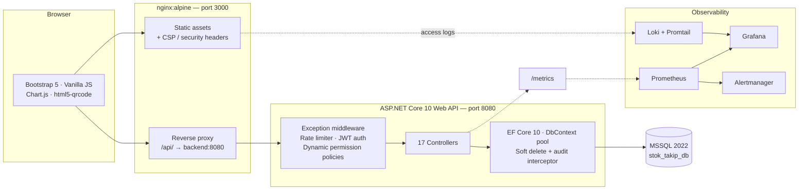

<div align="center">

# StockFlow

**A production-oriented inventory, warehouse and asset management platform.**

Granular RBAC, ACID-safe stock movements, hybrid EAV product information management,
serial-number asset tracking and a full observability stack — all containerised.

[](https://dotnet.microsoft.com/)
[](https://www.microsoft.com/sql-server)
[](https://getbootstrap.com/)
[](https://docs.docker.com/compose/)
[](https://prometheus.io/)
[](#project-status)

[English](README.md) · [Türkçe](README.tr.md)

</div>

---

## Table of Contents

- [About the Project](#about-the-project)
- [Features](#features)
- [Architecture](#architecture)
- [Tech Stack](#tech-stack)
- [Getting Started](#getting-started)
  - [Prerequisites](#prerequisites)
  - [Run with Docker (recommended)](#run-with-docker-recommended)
  - [Run locally without Docker](#run-locally-without-docker)
- [Configuration](#configuration)
- [Service Ports](#service-ports)
- [API Reference](#api-reference)
- [Data Model](#data-model)
- [Security Model](#security-model)
- [Observability](#observability)
- [Project Structure](#project-structure)
- [Project Status](#project-status)
- [Roadmap](#roadmap)
- [Contributing](#contributing)
- [License](#license)

---

## About the Project

StockFlow is a multi-warehouse inventory management system built for organisations that need
more than a spreadsheet: **who moved what, from where, to where, at what price, and under whose
authority** — with every change written to an immutable audit trail.

It is designed around four ideas:

1. **Authorisation is data, not code.** Roles, permissions, policies and even per-endpoint rate
   limits live in the database and are editable from the admin UI. Adding a new role does not
   require a redeploy.
2. **Stock truth is transactional.** Every movement (inbound, outbound, transfer) runs inside a
   database transaction, and stock levels carry a `RowVersion` column so concurrent operators
   can never silently overwrite each other.
3. **Products are not all the same shape.** A hybrid EAV / JSON attribute engine lets each
   category define its own attribute set (data type, UI component, min/max, allowed values),
   rendered dynamically by the frontend.
4. **Physical items are individually traceable.** Beyond aggregate quantities, each physical
   device can be registered with a unique serial number / QR code and tracked through
   assignment, breakdown, maintenance and return events on a timeline.

---

## Features

<details open>
<summary><b>Identity &amp; Access</b></summary>

- Registration with e-mail verification codes (10-minute validity)
- JWT authentication (1-hour lifetime) delivered both as a bearer token and as an
  `HttpOnly` + `Secure` + `SameSite=Strict` cookie
- **Server-side session table** — tokens can be revoked instantly; a background
  `SessionCleanupService` prunes expired sessions
- Account lockout after repeated failed login / verification / password-reset attempts
  (15-minute cooldown, tracked per operation type)
- Forgot-password and reset-password flows with single-use codes
- Self-service profile management and password change

</details>

<details open>
<summary><b>Dynamic RBAC &amp; Authorisation Policies</b></summary>

- 50+ fine-grained permissions (`Product.Add`, `Movement.Transfer`, `System.AuditLogs`, …)
  grouped into modules
- Roles with a hierarchy `Level` (superadmin 100 → viewer 10) and a protected `IsSystemRole` flag
- Permissions are injected into the token as `Permission` claims and re-validated
  server-side on every request via `OnTokenValidated`
- Custom `IAuthorizationPolicyProvider` resolves policies **from the database at runtime**
  (`PermissionPolicyProvider` + `RequirePermissionAttribute`)
- Each policy also carries its own rate-limit window (`PermitLimit` / `WindowSeconds`),
  editable from the *Authorization Policies* screen
- Frontend menu items and action buttons are rendered from the same permission set

</details>

<details open>
<summary><b>Catalogue &amp; PIM</b></summary>

- Hierarchical category tree (self-referencing FK) with drag &amp; drop ordering (SortableJS)
- Products with unique barcode, min stock level, cost / sale price and SKU generation
- **Hybrid EAV attribute engine**: per-category `AttributeRule` records define data type,
  UI component (textbox, select, radio, slider, toggle…), min/max bounds, required flag,
  display order and target level (Product or Asset)
- Managed `AttributeAllowedValue` lists with labels, ordering and active/inactive state
- Dynamic form rendering + cascading warehouse → location selection
- Bulk Excel / CSV import wizard with staged sessions, column mapping,
  distinct-value review, validation report and `ImportHistory` records

</details>

<details open>
<summary><b>Warehouse &amp; Stock Operations</b></summary>

- Warehouses and in-warehouse locations (shelf / bin codes, unique per warehouse)
- Stock levels per product × location with **optimistic concurrency** (`RowVersion`)
- Inbound / outbound / transfer movements inside ACID transactions
- Financial context on every movement: unit price, total price, document (invoice) number
- **Supplier snapshot** — supplier name and tax number are frozen onto the movement so history
  stays correct even if the supplier record changes later
- Suppliers with a product–supplier matrix: purchase price, supplier product code,
  lead time in days and a preferred-supplier flag
- Critical-stock notifications with severity levels (`WARNING` / `CRITICAL` / `DANGER`)

</details>

<details open>
<summary><b>Asset (Fixed Equipment) Tracking</b></summary>

- Unique serial-number registry for individual physical devices
- Assign to user / return, breakdown report / resolve, maintenance logging with
  next-maintenance date
- Full event timeline per asset (who held it, when, and why it changed hands)
- QR-code generation and camera scanning (`html5-qrcode`) — a scanned device opens its
  technical detail card directly on mobile

</details>

<details open>
<summary><b>Reporting &amp; Dashboard</b></summary>

- Summary cards, 30-day movement trend, category distribution, top products and
  movement summary charts (Chart.js)
- Export to PDF (`jsPDF` + AutoTable + `html2canvas`) and Excel / CSV (`xlsx-js-style`)
- Barcode label rendering with `JsBarcode`

</details>

<details open>
<summary><b>Auditing &amp; Compliance</b></summary>

- `SaveChangesAsync` is overridden in `AppDbContext`: **every** insert / update / delete on any
  entity is written to `security_audit_logs` with old and new values as JSON, acting user id
  and client IP
- Sensitive fields (`PasswordHash`, reset codes, `SessionToken`, `IdentityNumber`) are masked
  as `***` before being persisted to the log
- Soft delete (`IsDeleted`) with EF Core global query filters — nothing is physically removed
- Dedicated audit-log browser UI with per-user filtering

</details>

---

## Architecture



**Request lifecycle**

```
Browser → Nginx (/api/*) → Kestrel
  → ExceptionHandlingMiddleware
  → HTTP metrics collector (prometheus-net)
  → Forwarded headers → HTTPS redirect → CORS
  → Rate limiter (DB-driven policy, per user or per IP)
  → JWT authentication  ─┬─ cookie or bearer token
                         └─ session lookup (60 s memory cache) → role + permission claims
  → Authorization (RequirePermission → dynamic policy provider)
  → Controller → EF Core → MSSQL
  → SaveChangesAsync → security_audit_logs
```

---

## Tech Stack

| Layer | Technology |
| :--- | :--- |
| **Backend** | ASP.NET Core 10.0 Web API, C# 13, EF Core 10 (Code-First) |
| **Database** | Microsoft SQL Server 2022 (snake_case naming convention, filtered unique indexes) |
| **Auth** | JWT Bearer + HttpOnly cookie, ASP.NET Core Identity `PasswordHasher`, DB-backed sessions |
| **Frontend** | Vanilla JavaScript (ES6, no build step), Bootstrap 5.3, Bootstrap Icons, Inter font |
| **Charts / Export** | Chart.js 4, jsPDF + AutoTable, html2canvas, xlsx-js-style, ClosedXML (server-side) |
| **Scanning** | html5-qrcode 2.3, JsBarcode, QRious |
| **UI helpers** | SweetAlert2, SortableJS, noUiSlider |
| **Mail** | MailKit / MimeKit (SMTP + STARTTLS) |
| **API docs** | OpenAPI (`Microsoft.AspNetCore.OpenApi`) + Scalar UI |
| **Web server** | Nginx (static hosting, reverse proxy, CSP &amp; security headers) |
| **Monitoring** | prometheus-net, Prometheus, Grafana, Alertmanager, Loki + Promtail, node-exporter, cAdvisor, sql_exporter, nginx-exporter |
| **Runtime** | Docker &amp; Docker Compose |

---

## Getting Started

### Prerequisites

| Path | Requirements |
| :--- | :--- |
| **Docker (recommended)** | Docker Engine 24+ and Docker Compose v2 |
| **Local** | .NET SDK 10.0, SQL Server 2019+ (or Docker for the DB only), any static file server |

### Run with Docker (recommended)

```bash
git clone https://github.com/MustafArikan/StockFlow.git
```

```bash
cd StockFlow
```

Create the environment file (see [Configuration](#configuration) for every key):

```bash
cp .env.example .env
```

> The repository ships a working `.env` for local development. **Change every password and the
> JWT secret before exposing the stack to anything other than `localhost`.**

Start the full stack:

```bash
docker compose up -d --build
```

Database migrations and seed data are applied automatically on backend start
(`Database.Migrate()` + `DbInitializer`).

| Service | URL |
| :--- | :--- |
| Frontend | http://localhost:3000 |
| API | http://localhost:5000/api |
| Health check | http://localhost:5000/api/health |
| API docs (Development only) | http://localhost:5000/scalar/v1 |
| Grafana | http://localhost:3001 |
| Prometheus | http://localhost:9090 |

**Default development accounts** (seeded only when `ASPNETCORE_ENVIRONMENT=Development`):

| Role | E-mail | Password |
| :--- | :--- | :--- |
| admin | `admin@godeva.com.tr` | `adminpassword23!` |
| viewer | `test@godeva.com.tr` | `testpassword23!` |

In Production no user is seeded unless the `AdminPassword` configuration key is supplied; the
application also refuses to start without `JwtSettings__SecretKey`.

Stop the stack:

```bash
docker compose down
```

### Run locally without Docker

Start only the database:

```bash
docker compose up -d db
```

Point `backend/appsettings.Development.json` at your SQL Server instance, then:

```bash
dotnet run --project backend
```

The API listens on `http://localhost:5136` (see `Properties/launchSettings.json`).
Serve the `frontend/` folder with any static server — when it is opened from `file://`
or a different origin, `frontend/js/config.js` falls back to `http://localhost:5000/api`,
so adjust `API_BASE_URL` if you use a different port.

**Entity Framework commands**

```bash
dotnet ef migrations add MigrationName --project backend
```

```bash
dotnet ef database update --project backend
```

---

## Configuration

All runtime configuration is supplied through environment variables (`.env`, consumed by
`docker-compose.yml`) or `appsettings.json`. Nested .NET keys use the `__` separator.

| Variable | Maps to | Description |
| :--- | :--- | :--- |
| `MSSQL_SA_PASSWORD` | `ConnectionStrings__DefaultConnection` | SQL Server `sa` password. Must satisfy SQL Server complexity rules. |
| `DB_PORT` | – | Host port bound to MSSQL `1433` (published on `127.0.0.1` only). |
| `BACKEND_PORT` | – | Host port bound to the API container's `8080`. |
| `FRONTEND_PORT` | – | Host port bound to the Nginx container's `80`. |
| `ASPNETCORE_ENVIRONMENT` | – | `Development` enables Scalar/OpenAPI, permissive CORS and seed users. |
| `JWT_SECRET_KEY` | `JwtSettings__SecretKey` | HMAC signing key, **min. 32 bytes**. Required in Production. |
| `JWT_ISSUER` | `JwtSettings__Issuer` | Token issuer (default `StockFlowBackend`). |
| `JWT_AUDIENCE` | `JwtSettings__Audience` | Token audience (default `StockFlowFrontend`). |
| `SMTP_HOST` | `EmailSettings__SmtpHost` | SMTP host for verification / reset mails. |
| `SMTP_PORT` | `EmailSettings__SmtpPort` | SMTP port (STARTTLS). |
| `SMTP_USER` | `EmailSettings__SmtpUser` | SMTP username. |
| `SMTP_PASS` | `EmailSettings__SmtpPass` | SMTP password. |
| `PROMETHEUS_PORT` | – | Host port for Prometheus. |
| `GRAFANA_PORT` | – | Host port for Grafana. |
| `GRAFANA_ADMIN_USER` | `GF_SECURITY_ADMIN_USER` | Grafana admin username. |
| `GRAFANA_ADMIN_PASSWORD` | `GF_SECURITY_ADMIN_PASSWORD` | Grafana admin password. |
| `AdminPassword` | `AdminPassword` | Production-only: password for the seeded `admin@godeva.com.tr` account. |
| `CorsSettings__AllowedOrigins` | `CorsSettings:AllowedOrigins` | Allowed origins array in Production (default `https://stokflow.com`). |

> `.env` is git-ignored. The four `SMTP_*` keys are referenced by `docker-compose.yml` but are
> not present in the sample file — add them (empty values are acceptable) if you want e-mail
> delivery to work.

---

## Service Ports

| Container | Internal | Host binding | Purpose |
| :--- | :---: | :--- | :--- |
| `stok_frontend_client` | 80 | `${FRONTEND_PORT}` → 3000 | Nginx static host + API reverse proxy |
| `stok_backend_api` | 8080 | `127.0.0.1:${BACKEND_PORT}` → 5000 | ASP.NET Core Web API |
| `stok_mssql` | 1433 | `127.0.0.1:${DB_PORT}` → 1433 | SQL Server 2022 |
| `stok_prometheus` | 9090 | `127.0.0.1:9090` | Metrics store, 30-day retention |
| `stok_grafana` | 3000 | `127.0.0.1:3001` | Dashboards |
| `stok_alertmanager` | 9093 | `127.0.0.1:9093` | Alert routing |
| `stok_loki` | 3100 | `127.0.0.1:3100` | Log aggregation |
| `stok_promtail` | – | – | Ships Nginx logs to Loki |
| `stok_node_exporter` | 9100 | – | Host CPU / RAM / disk metrics |
| `stok_cadvisor` | 8080 | `127.0.0.1:8081` | Container resource metrics |
| `stok_mssql_exporter` | 9399 | `127.0.0.1:9399` | SQL Server metrics |
| `stok_nginx_exporter` | 9113 | `127.0.0.1:9113` | Nginx metrics |

Every service except the frontend is published on `127.0.0.1` only, so nothing but the UI is
reachable from outside the host.

---

## API Reference

Base path: `/api`. All endpoints require authentication unless marked `AllowAnonymous`
(a global `FallbackPolicy` enforces this). Interactive documentation is available at
`/scalar/v1` in Development.

<details>
<summary><b>Authentication</b> — <code>/api/auth</code></summary>

| Method | Endpoint | Auth | Notes |
| :--- | :--- | :--- | :--- |
| `POST` | `/register` | Anonymous | Rate limited: 5 req/min per IP |
| `POST` | `/verify-email` | Anonymous | 10-minute code, 15-minute lockout on abuse |
| `POST` | `/login` | Anonymous | Issues JWT + `jwt` cookie, creates a session row |
| `POST` | `/logout` | Authenticated | Deactivates the session |
| `GET` | `/me` | Authenticated | Current profile, role and permissions |
| `PUT` | `/profile` | Authenticated | Update own profile |
| `POST` | `/change-password` | Authenticated | |
| `POST` | `/forgot-password` | Anonymous | Sends a reset code by e-mail |
| `POST` | `/verify-reset-code` | Anonymous | |
| `POST` | `/reset-password` | Anonymous | |

</details>

<details>
<summary><b>Catalogue</b> — <code>/api/products</code>, <code>/api/categories</code>, <code>/api/attribute-rules</code></summary>

| Method | Endpoint | Permission policy |
| :--- | :--- | :--- |
| `GET` | `/products` | `RequireProductRead` (paged, searchable, filterable) |
| `GET` | `/products/{id}` | `RequireProductRead` |
| `GET` | `/products/search` | `RequireProductRead` |
| `GET` | `/products/by-barcode/{barcode}` | `RequireProductRead` |
| `POST` | `/products` | `RequireProductWrite` |
| `PUT` | `/products/{id}` | `RequireProductWrite` |
| `DELETE` | `/products/{id}` | `RequireProductWrite` (soft delete) |
| `POST` | `/products/generate-sku` | `RequireProductWrite` |
| `POST` | `/products/import/session` | `RequireProductWrite` — stages an upload |
| `GET` | `/products/import/session/{id}/distinct-values` | `RequireProductWrite` |
| `POST` | `/products/import/session/{id}/commit` | `RequireProductWrite` |
| `GET` | `/categories` | `RequireCategoryRead` (hierarchical tree) |
| `GET` | `/categories/{id}/check-dependencies` | `RequireCategoryRead` |
| `POST` `PUT` `DELETE` | `/categories[/{id}]` | `RequireCategoryWrite` |
| `GET` | `/attribute-rules/category/{categoryId}` | `RequireCategoryRead` |
| `POST` `PUT` `DELETE` | `/attribute-rules[/{id}]` | `RequireCategoryWrite` |
| `PUT` | `/attribute-rules/reorder` | `RequireCategoryWrite` |

</details>

<details>
<summary><b>Warehouses, locations &amp; stock</b></summary>

| Method | Endpoint | Permission policy |
| :--- | :--- | :--- |
| `GET` | `/warehouses` · `/warehouses/{id}` · `/warehouses/{id}/stocks` | `RequireWarehouseRead` |
| `POST` `PUT` `DELETE` | `/warehouses[/{id}]` | `RequireWarehouseWrite` |
| `GET` | `/locations` · `/locations/by-warehouse/{id}` · `/locations/by-code/{code}` | `RequireLocationRead` |
| `POST` `DELETE` | `/locations[/{id}]` | `RequireLocationWrite` |
| `GET` | `/stock-levels/by-product/{productId}` | `RequireProductRead` |
| `GET` | `/stock/movements` | `RequireStockMovementRead` (type, date range, search, paging) |
| `GET` | `/stock/movements/product/{productId}` | `RequireStockMovementRead` |
| `POST` | `/stock/movements` | `RequireStockMovementWrite` + per-type permission (`Movement.Inbound` / `Movement.Outbound` / `Movement.Transfer`) |

</details>

<details>
<summary><b>Suppliers &amp; assets</b></summary>

| Method | Endpoint | Permission policy |
| :--- | :--- | :--- |
| `GET` | `/suppliers` | `RequireSupplierRead` |
| `POST` `PUT` `DELETE` | `/suppliers[/{id}]` | `RequireSupplierWrite` |
| `GET` | `/products/{productId}/suppliers` · `/suppliers/{supplierId}/products` | `RequireSupplierRead` |
| `POST` `DELETE` | `/products/{productId}/suppliers[/{supplierId}]` | `RequireProductSupplierWrite` |
| `GET` | `/assets` · `/assets/{serialNumber}/timeline` | `RequireAssetRead` |
| `POST` | `/assets` | `RequireAssetWrite` |
| `PUT` | `/assets/{id}/assign` · `/assets/{id}/return` | `RequireAssetWrite` |
| `POST` | `/assets/{id}/breakdown` · `/resolve` · `/maintenance` | `RequireAssetWrite` |
| `DELETE` | `/assets/{id}` | `RequireAssetWrite` |

</details>

<details>
<summary><b>Reporting, notifications &amp; administration</b></summary>

| Method | Endpoint | Permission policy |
| :--- | :--- | :--- |
| `GET` | `/reports/dashboard-summary` | `RequireDashboardRead` |
| `GET` | `/reports/trend` · `/by-category` · `/top-products` · `/movement-summary` | `RequireReportRead` |
| `GET` | `/notifications` | `RequireNotificationRead` |
| `PUT` | `/notifications/{id}/read` · `POST /notifications/read-all` | `RequireNotificationRead` |
| `GET` `POST` `PUT` `DELETE` | `/users[/{id}]` · `/users/{id}/role` | `RequireUserManage` |
| `GET` | `/roles` | `RequireUserManage` |
| `GET` | `/roles/permissions` · `/roles/{id}` | `SuperAdminOnly` |
| `POST` `PUT` `DELETE` | `/roles[/{id}]` | `SuperAdminOnly` |
| `GET` `PUT` | `/authorizationpolicies[/{id}]` | `SuperAdminOnly` |
| `GET` | `/audit-logs` · `/audit-logs/user/{userId}` · `/audit-logs/import-history` | `RequireAuditLogRead` |
| `GET` | `/health` | Anonymous |
| `GET` | `/metrics` | Anonymous — **must not be exposed publicly** |

</details>

---

## Data Model

Tables are generated in `snake_case` by an EF Core naming convention. Every entity inherits
`BaseEntity` (`id`, `created_at`, `is_deleted`) and is filtered by a global soft-delete query filter.

| Table | Description | Key constraints |
| :--- | :--- | :--- |
| `users` | Accounts, verification and lockout counters | `email` UQ · FK → `app_roles` (Restrict) |
| `user_sessions` | Active JWT sessions, device and IP | `session_token` UQ |
| `app_roles` | Roles with `level` hierarchy and `is_system_role` | `name` UQ |
| `app_permissions` | Granular permissions grouped by module | `name` UQ |
| `app_role_permissions` | Role ↔ permission matrix | (`role_id`, `permission_id`) UQ |
| `app_authorization_policies` | Policy key + rate-limit window | `key` UQ |
| `app_policy_permissions` | Policy ↔ permission matrix | (`policy_id`, `permission_id`) UQ |
| `categories` | Self-referencing category tree | `name` UQ (filtered) · `parent_id` self FK |
| `attribute_rules` | Per-category EAV definitions | FK → `categories` |
| `attribute_allowed_values` | Managed option lists for rules | FK → `attribute_rules` |
| `products` | Catalogue, cost/price, JSON attributes | `barcode` UQ (filtered) |
| `warehouses` | Warehouse definitions | (`name`, `address`) UQ (filtered) |
| `locations` | Shelves / bins inside a warehouse | (`warehouse_id`, `code`) UQ (filtered) |
| `stock_levels` | Quantity per product × location | (`product_id`, `location_id`) UQ · `row_version` |
| `stock_movements` | IN / OUT / TRANSFER ledger with prices | FK → products, users, suppliers, locations |
| `suppliers` | Supplier companies with tax number | `name` UQ (filtered) |
| `product_suppliers` | Purchase price, lead time, preferred flag | (`product_id`, `supplier_id`) UQ (filtered) |
| `assets` | Individually tracked physical devices | `serial_number` UQ (filtered) |
| `asset_histories` | Assignment / maintenance / breakdown events | FK → `assets`, `users` |
| `notifications` | Critical-stock alerts with severity | |
| `import_histories` | Bulk import result records | FK → `users` |
| `security_audit_logs` | Automatic change log (old/new JSON, IP) | FK → `users` |

*UQ = unique constraint · FK = foreign key · “filtered” = unique only among non-deleted rows.*

---

## Security Model

| Control | Implementation |
| :--- | :--- |
| Password storage | ASP.NET Core Identity `PasswordHasher<User>` (PBKDF2) |
| Token transport | `HttpOnly`, `Secure`, `SameSite=Strict` cookie; bearer header also supported |
| Session revocation | Every token carries a `jti` that maps to a `user_sessions` row, re-checked on each request (60-second memory cache) |
| Brute-force defence | Per-operation failed-attempt counters with 15-minute lockout; `AuthLimit` fixed-window limiter of 5 requests/min per IP |
| Endpoint throttling | Per-policy limiter values read from the database at startup |
| Authorisation default | Global `FallbackPolicy` requires an authenticated user — endpoints are closed unless explicitly opened |
| Request size | Kestrel body limit of 1 MB; Nginx `client_max_body_size 10M` for uploads |
| Transport headers | CSP, `X-Content-Type-Options`, `Referrer-Policy`, HSTS set by Nginx; `UseHttpsRedirection` in the API |
| Proxy awareness | `ForwardedHeaders` restricted to the Docker network `172.16.0.0/12` |
| CORS | Wide open in Development, allow-list only in Production |
| Audit trail | Automatic, unavoidable — written from `SaveChangesAsync` with sensitive values masked |
| Data retention | Soft delete only; historical rows are preserved for auditing |

> **Hardening checklist before production**
> Rotate `JWT_SECRET_KEY`, replace both default passwords, set `ASPNETCORE_ENVIRONMENT=Production`,
> configure `CorsSettings__AllowedOrigins`, terminate TLS in front of Nginx, and keep `/metrics`
> unreachable from the public internet.

---

## Observability

The backend exposes `/metrics` via `prometheus-net`, combining ASP.NET Core HTTP metrics with
StockFlow business metrics:

| Metric | Type | Meaning |
| :--- | :--- | :--- |
| `stockflow_stock_movements_total` | Counter | Movements, labelled by `movement_type` and `warehouse` |
| `stockflow_login_attempts_total` | Counter | Login attempts, labelled `success` / `failed` |
| `stockflow_active_sessions` | Gauge | Currently valid sessions |
| `stockflow_low_stock_products` | Gauge | Products below their minimum stock level |
| `stockflow_rate_limit_rejections_total` | Counter | Requests rejected with HTTP 429 |

Prometheus scrapes the backend, MSSQL, Nginx, cAdvisor, node-exporter and itself every 15 s.
Pre-provisioned Grafana dashboards (ASP.NET Core, Nginx, Nginx-via-Loki, node-exporter) and
Prometheus datasources are mounted from `monitoring/grafana/provisioning`.

Alert rules in `monitoring/prometheus/alert_rules.yml`: `BackendDown`, `DatabaseDown`,
`HighRequestLatency` (p95 &gt; 2 s), `HighErrorRate` (5xx &gt; 5 %), `HighDiskUsage` (&gt; 85 %),
`HighMemoryUsage` (&gt; 90 %), `BackendHighCPU`.

---

## Project Structure

```
StockFlow/
├── backend/                     # ASP.NET Core 10 Web API
│   ├── Attributes/              # RequirePermission, NormalizePagination
│   ├── Authorization/           # Dynamic policy provider + permission handler
│   ├── Constants/               # Policy key constants
│   ├── Controllers/             # 17 API controllers
│   ├── Data/                    # AppDbContext (audit + soft delete), DbInitializer
│   ├── DTOs/                    # Request / response contracts
│   ├── Metrics/                 # Prometheus business metrics
│   ├── Middlewares/             # Global exception handling
│   ├── Migrations/              # EF Core Code-First migrations
│   ├── Models/                  # Entities (BaseEntity-derived)
│   ├── Services/                # E-mail, import sessions, session cleanup
│   ├── Dockerfile               # Multi-stage build, non-root `app` user
│   └── Program.cs               # Composition root and middleware pipeline
├── frontend/                    # Static client (no build step)
│   ├── css/                     # style.css, import-wizard.css
│   ├── js/                      # config.js (API client + layout engine), page modules
│   │   └── partials/            # sidebar, topbar, pagination renderers
│   └── *.html                   # 16 pages (dashboard, products, movements, assets, …)
├── nginx/default.conf           # Static host, reverse proxy, CSP and security headers
├── monitoring/                  # Prometheus, Grafana, Loki, Promtail, exporters
├── docker-compose.yml           # 12-service stack
└── .env                         # Local environment variables (git-ignored)
```

---

## Project Status

Actively developed. The application is feature-complete for internal / pre-production use;
the remaining work is production hardening.

| Area | Status |
| :--- | :--- |
| Auth, RBAC, dynamic policies | ✅ Complete |
| Catalogue, PIM/EAV, bulk import | ✅ Complete |
| Warehouses, locations, stock movements | ✅ Complete |
| Suppliers &amp; product–supplier matrix | ✅ Complete |
| Asset tracking &amp; QR/barcode scanning | ✅ Complete |
| Dashboard, reports, PDF/Excel export | ✅ Complete |
| Audit logging &amp; soft delete | ✅ Complete |
| Monitoring stack (Prometheus/Grafana/Loki) | ✅ Complete |

---

## Contributing

1. Branch from `dev` using the existing convention: `feature/<topic>`, `fix/<topic>`
   or `<name>/<topic>`.
2. Write commit messages in the Conventional Commits style already used in the history,
   e.g. `feat(movements): add camera-based barcode search`.
3. Keep migrations additive — never edit an applied migration; generate a new one.
4. Open a pull request against `dev`. `main` is release-only and receives merges from `dev`.

Before submitting:

```bash
dotnet build backend/backend.csproj
```

```bash
docker compose up -d --build
```

---

## License

No license file has been added to this repository yet, so all rights are reserved by default.
If you intend to open the project up, add a `LICENSE` file (MIT and Apache-2.0 are the common
choices) and update this section.

---

<div align="center">
<sub>Built by the StockFlow team · <a href="https://github.com/MustafArikan/StockFlow">github.com/MustafArikan/StockFlow</a></sub>
</div>
