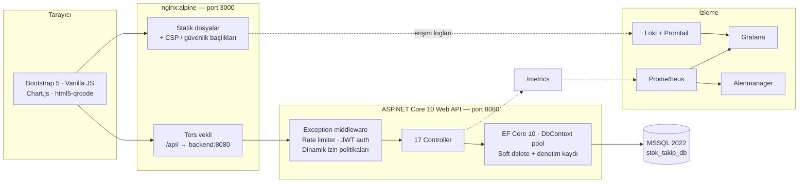

<div align="center">

# StockFlow

**Canlı ortama hazırlanan bir stok, depo ve ekipman yönetim platformu.**

Granüler yetkilendirme (RBAC), ACID uyumlu stok hareketleri, hibrit EAV ürün bilgi yönetimi,
seri numarası bazlı ekipman takibi ve uçtan uca izleme altyapısı — tamamı konteynerize.

[](https://dotnet.microsoft.com/)
[](https://www.microsoft.com/sql-server)
[](https://getbootstrap.com/)
[](https://docs.docker.com/compose/)
[](https://prometheus.io/)
[](#proje-durumu)

[English](README.md) · [Türkçe](README.tr.md)

</div>

---

## İçindekiler

- [Proje Hakkında](#proje-hakkında)
- [Özellikler](#özellikler)
- [Mimari](#mimari)
- [Teknoloji Yığını](#teknoloji-yığını)
- [Hızlı Başlangıç](#hızlı-başlangıç)
  - [Gereksinimler](#gereksinimler)
  - [Docker ile çalıştırma (önerilen)](#docker-ile-çalıştırma-önerilen)
  - [Docker olmadan yerel çalıştırma](#docker-olmadan-yerel-çalıştırma)
- [Yapılandırma](#yapılandırma)
- [Servis Portları](#servis-portları)
- [API Referansı](#api-referansı)
- [Veri Modeli](#veri-modeli)
- [Güvenlik Modeli](#güvenlik-modeli)
- [İzleme (Observability)](#i̇zleme-observability)
- [Proje Yapısı](#proje-yapısı)
- [Proje Durumu](#proje-durumu)
- [Yol Haritası](#yol-haritası)
- [Katkı Rehberi](#katkı-rehberi)
- [Lisans](#lisans)

---

## Proje Hakkında

StockFlow, elektronik tablonun yetmediği noktada devreye giren çok depolu bir stok yönetim
sistemidir: **kim, neyi, nereden nereye, hangi fiyatla ve hangi yetkiyle taşıdı** sorusunun
cevabını her değişikliği silinemez bir denetim kaydına yazarak verir.

Sistem dört temel fikir üzerine kurulmuştur:

1. **Yetkilendirme koda değil veriye gömülüdür.** Roller, izinler, politikalar ve hatta
   endpoint bazlı istek limitleri veritabanında tutulur ve yönetim ekranından düzenlenebilir.
   Yeni bir rol eklemek için yeniden yayına (deploy) gerek yoktur.
2. **Stok gerçeği transaction ile korunur.** Her hareket (giriş, çıkış, transfer) veritabanı
   transaction'ı içinde çalışır; stok seviyelerinde `RowVersion` kolonu bulunduğu için eşzamanlı
   çalışan iki operatör birbirinin kaydını sessizce ezemez.
3. **Her ürün aynı şekilde tanımlanmaz.** Hibrit EAV / JSON özellik motoru sayesinde her kategori
   kendi özellik setini (veri tipi, arayüz bileşeni, min/maks, seçenek listesi) tanımlar; form
   arayüzde dinamik olarak üretilir.
4. **Fiziksel cihazlar tekil olarak izlenir.** Toplam miktarın ötesinde, her fiziksel cihaz tekil
   seri numarası / QR kodu ile kaydedilir; atama, arıza, bakım ve iade olayları bir zaman
   çizelgesi üzerinde takip edilir.

---

## Özellikler

<details open>
<summary><b>Kimlik ve Erişim Yönetimi</b></summary>

- E-posta doğrulama kodu ile kayıt (10 dakika geçerlilik)
- JWT kimlik doğrulama (1 saat ömür); hem bearer token hem de
  `HttpOnly` + `Secure` + `SameSite=Strict` çerez olarak taşınır
- **Sunucu taraflı oturum tablosu** — token'lar anında iptal edilebilir; arka planda çalışan
  `SessionCleanupService` süresi dolmuş oturumları temizler
- Ardışık hatalı giriş / doğrulama / şifre sıfırlama denemelerinde hesap kilitleme
  (işlem tipine göre ayrı sayaç, 15 dakika bekleme)
- Tek kullanımlık kod ile şifremi unuttum ve şifre sıfırlama akışları
- Kullanıcının kendi profilini ve şifresini yönetmesi

</details>

<details open>
<summary><b>Dinamik RBAC ve Yetki Politikaları</b></summary>

- Modüllere ayrılmış 50+ granüler izin (`Product.Add`, `Movement.Transfer`, `System.AuditLogs` …)
- Hiyerarşi seviyesi (`Level`: superadmin 100 → viewer 10) ve korumalı `IsSystemRole` bayrağı
  taşıyan roller
- İzinler token'a `Permission` claim'i olarak eklenir ve her istekte `OnTokenValidated`
  içinde sunucu tarafında yeniden doğrulanır
- Özel `IAuthorizationPolicyProvider` politikaları **çalışma anında veritabanından** çözer
  (`PermissionPolicyProvider` + `RequirePermissionAttribute`)
- Her politika kendi istek limiti penceresini taşır (`PermitLimit` / `WindowSeconds`);
  *Yetki Politikaları* ekranından düzenlenebilir
- Arayüzdeki menü ve aksiyon butonları da aynı izin setinden üretilir

</details>

<details open>
<summary><b>Katalog ve PIM</b></summary>

- Hiyerarşik kategori ağacı (self FK) ve sürükle-bırak sıralama (SortableJS)
- Tekil barkod, minimum stok seviyesi, maliyet / satış fiyatı ve SKU üretimi ile ürünler
- **Hibrit EAV özellik motoru**: kategori bazlı `AttributeRule` kayıtları veri tipini,
  arayüz bileşenini (textbox, select, radio, slider, toggle …), min/maks sınırları,
  zorunluluk bayrağını, sıralamayı ve hedef seviyeyi (Ürün veya Ekipman) tanımlar
- Etiket, sıra ve aktiflik durumu taşıyan yönetilebilir `AttributeAllowedValue` listeleri
- Dinamik form üretimi + kademeli (cascading) depo → raf seçimi
- Aşamalı oturumlar, kolon eşleştirme, tekil değer incelemesi, doğrulama raporu ve
  `ImportHistory` kaydı içeren toplu Excel / CSV içe aktarma sihirbazı

</details>

<details open>
<summary><b>Depo ve Stok Operasyonları</b></summary>

- Depolar ve depo içi konumlar (raf / bölge kodları, depo bazında tekil)
- Ürün × konum bazında **iyimser eşzamanlılık kontrollü** (`RowVersion`) stok seviyeleri
- ACID transaction içinde giriş / çıkış / transfer hareketleri
- Her harekette finansal bağlam: birim fiyat, toplam fiyat, belge (fatura/irsaliye) numarası
- **Tedarikçi anlık görüntüsü** — tedarikçi adı ve vergi numarası harekete dondurulur;
  tedarikçi kaydı sonradan değişse bile geçmiş bozulmaz
- Ürün–tedarikçi matrisi ile tedarikçiler: alış fiyatı, tedarikçi ürün kodu,
  teslim süresi (gün) ve tercih edilen tedarikçi bayrağı
- Önem derecesi (`WARNING` / `CRITICAL` / `DANGER`) taşıyan kritik stok bildirimleri

</details>

<details open>
<summary><b>Ekipman (Atama) Takibi</b></summary>

- Tekil fiziksel cihazlar için seri numarası kütüğü
- Kullanıcıya atama / iade, arıza bildirimi / çözüm, sonraki bakım tarihiyle bakım kaydı
- Cihaz başına tam olay zaman çizelgesi (kim, ne zaman, neden devraldı)
- QR kod üretimi ve kamerayla okuma (`html5-qrcode`) — okutulan cihaz mobilde doğrudan
  teknik detay kartını açar

</details>

<details open>
<summary><b>Raporlama ve Dashboard</b></summary>

- Özet kartları, 30 günlük hareket trendi, kategori dağılımı, en çok işlem gören ürünler ve
  hareket özeti grafikleri (Chart.js)
- PDF (`jsPDF` + AutoTable + `html2canvas`) ve Excel / CSV (`xlsx-js-style`) dışa aktarma
- `JsBarcode` ile barkod etiketi üretimi

</details>

<details open>
<summary><b>Denetim ve Uyumluluk</b></summary>

- `AppDbContext` içinde `SaveChangesAsync` ezilmiştir: herhangi bir varlık üzerindeki **her**
  ekleme / güncelleme / silme, eski ve yeni değerleri JSON olarak, işlemi yapan kullanıcı ve
  istemci IP'si ile birlikte `security_audit_logs` tablosuna yazılır
- Hassas alanlar (`PasswordHash`, sıfırlama kodları, `SessionToken`, `IdentityNumber`)
  loga yazılmadan önce `***` ile maskelenir
- EF Core global sorgu filtreleriyle yumuşak silme (`IsDeleted`) — hiçbir kayıt fiziksel olarak
  silinmez
- Kullanıcı bazlı filtreleme yapabilen ayrı denetim log ekranı

</details>

---

## Mimari



**İstek yaşam döngüsü**

```
Tarayıcı → Nginx (/api/*) → Kestrel
  → ExceptionHandlingMiddleware
  → HTTP metrik toplayıcı (prometheus-net)
  → Forwarded headers → HTTPS yönlendirme → CORS
  → Rate limiter (DB kaynaklı politika, kullanıcı veya IP bazlı)
  → JWT kimlik doğrulama ─┬─ çerez veya bearer token
                          └─ oturum kontrolü (60 sn bellek önbelleği) → rol + izin claim'leri
  → Yetkilendirme (RequirePermission → dinamik politika sağlayıcı)
  → Controller → EF Core → MSSQL
  → SaveChangesAsync → security_audit_logs
```

---

## Teknoloji Yığını

| Katman | Teknoloji |
| :--- | :--- |
| **Backend** | ASP.NET Core 10.0 Web API, C# 13, EF Core 10 (Code-First) |
| **Veritabanı** | Microsoft SQL Server 2022 (snake_case adlandırma, filtrelenmiş tekil indeksler) |
| **Kimlik doğrulama** | JWT Bearer + HttpOnly çerez, ASP.NET Core Identity `PasswordHasher`, DB tabanlı oturumlar |
| **Frontend** | Saf JavaScript (ES6, build adımı yok), Bootstrap 5.3, Bootstrap Icons, Inter fontu |
| **Grafik / Dışa aktarma** | Chart.js 4, jsPDF + AutoTable, html2canvas, xlsx-js-style, ClosedXML (sunucu tarafı) |
| **Okuyucu** | html5-qrcode 2.3, JsBarcode, QRious |
| **Arayüz yardımcıları** | SweetAlert2, SortableJS, noUiSlider |
| **E-posta** | MailKit / MimeKit (SMTP + STARTTLS) |
| **API dokümantasyonu** | OpenAPI (`Microsoft.AspNetCore.OpenApi`) + Scalar UI |
| **Web sunucusu** | Nginx (statik sunum, ters vekil, CSP ve güvenlik başlıkları) |
| **İzleme** | prometheus-net, Prometheus, Grafana, Alertmanager, Loki + Promtail, node-exporter, cAdvisor, sql_exporter, nginx-exporter |
| **Çalışma ortamı** | Docker ve Docker Compose |

---

## Hızlı Başlangıç

### Gereksinimler

| Yöntem | Gerekenler |
| :--- | :--- |
| **Docker (önerilen)** | Docker Engine 24+ ve Docker Compose v2 |
| **Yerel** | .NET SDK 10.0, SQL Server 2019+ (veya sadece veritabanı için Docker), herhangi bir statik sunucu |

### Docker ile çalıştırma (önerilen)

```bash
git clone https://github.com/MustafArikan/StockFlow.git
```

```bash
cd StockFlow
```

Ortam değişkeni dosyasını oluşturun (tüm anahtarlar için [Yapılandırma](#yapılandırma) bölümüne bakın):

```bash
cp .env.example .env
```

> Depo, yerel geliştirme için çalışır durumda bir `.env` dosyasıyla gelir. **Stack'i
> `localhost` dışında bir yere açmadan önce tüm parolaları ve JWT anahtarını değiştirin.**

Tüm servisleri başlatın:

```bash
docker compose up -d --build
```

Veritabanı migration'ları ve başlangıç verileri backend ayağa kalkarken otomatik uygulanır
(`Database.Migrate()` + `DbInitializer`).

| Servis | Adres |
| :--- | :--- |
| Frontend | http://localhost:3000 |
| API | http://localhost:5000/api |
| Sağlık kontrolü | http://localhost:5000/api/health |
| API dokümantasyonu (yalnız Development) | http://localhost:5000/scalar/v1 |
| Grafana | http://localhost:3001 |
| Prometheus | http://localhost:9090 |

**Varsayılan geliştirme hesapları** (yalnızca `ASPNETCORE_ENVIRONMENT=Development` iken oluşturulur):

| Rol | E-posta | Parola |
| :--- | :--- | :--- |
| admin | `admin@godeva.com.tr` | `adminpassword23!` |
| viewer | `test@godeva.com.tr` | `testpassword23!` |

Production ortamında `AdminPassword` yapılandırma anahtarı verilmedikçe hiçbir kullanıcı
oluşturulmaz; ayrıca `JwtSettings__SecretKey` tanımlı değilse uygulama başlamayı reddeder.

Stack'i durdurmak için:

```bash
docker compose down
```

### Docker olmadan yerel çalıştırma

Yalnızca veritabanını ayağa kaldırın:

```bash
docker compose up -d db
```

`backend/appsettings.Development.json` içindeki bağlantı dizesini kendi SQL Server örneğinize
göre düzenleyip çalıştırın:

```bash
dotnet run --project backend
```

API `http://localhost:5136` adresinde dinler (bkz. `Properties/launchSettings.json`).
`frontend/` klasörünü herhangi bir statik sunucu ile yayınlayın — dosya `file://` üzerinden
veya farklı bir origin'den açıldığında `frontend/js/config.js` otomatik olarak
`http://localhost:5000/api` adresine düşer; farklı bir port kullanıyorsanız `API_BASE_URL`
değerini güncelleyin.

**Entity Framework komutları**

```bash
dotnet ef migrations add MigrationAdi --project backend
```

```bash
dotnet ef database update --project backend
```

---

## Yapılandırma

Tüm çalışma zamanı ayarları ortam değişkenleri (`docker-compose.yml` tarafından okunan `.env`)
veya `appsettings.json` üzerinden verilir. İç içe .NET anahtarlarında `__` ayıracı kullanılır.

| Değişken | Karşılığı | Açıklama |
| :--- | :--- | :--- |
| `MSSQL_SA_PASSWORD` | `ConnectionStrings__DefaultConnection` | SQL Server `sa` parolası. SQL Server karmaşıklık kurallarını sağlamalıdır. |
| `DB_PORT` | – | MSSQL `1433` portunun host karşılığı (yalnız `127.0.0.1` üzerinde yayınlanır). |
| `BACKEND_PORT` | – | API konteynerinin `8080` portunun host karşılığı. |
| `FRONTEND_PORT` | – | Nginx konteynerinin `80` portunun host karşılığı. |
| `ASPNETCORE_ENVIRONMENT` | – | `Development` iken Scalar/OpenAPI, serbest CORS ve örnek kullanıcılar aktif olur. |
| `JWT_SECRET_KEY` | `JwtSettings__SecretKey` | HMAC imzalama anahtarı, **en az 32 byte**. Production'da zorunludur. |
| `JWT_ISSUER` | `JwtSettings__Issuer` | Token yayıncısı (varsayılan `StockFlowBackend`). |
| `JWT_AUDIENCE` | `JwtSettings__Audience` | Token hedef kitlesi (varsayılan `StockFlowFrontend`). |
| `SMTP_HOST` | `EmailSettings__SmtpHost` | Doğrulama / sıfırlama e-postaları için SMTP sunucusu. |
| `SMTP_PORT` | `EmailSettings__SmtpPort` | SMTP portu (STARTTLS). |
| `SMTP_USER` | `EmailSettings__SmtpUser` | SMTP kullanıcı adı. |
| `SMTP_PASS` | `EmailSettings__SmtpPass` | SMTP parolası. |
| `PROMETHEUS_PORT` | – | Prometheus host portu. |
| `GRAFANA_PORT` | – | Grafana host portu. |
| `GRAFANA_ADMIN_USER` | `GF_SECURITY_ADMIN_USER` | Grafana yönetici kullanıcı adı. |
| `GRAFANA_ADMIN_PASSWORD` | `GF_SECURITY_ADMIN_PASSWORD` | Grafana yönetici parolası. |
| `AdminPassword` | `AdminPassword` | Yalnız Production: oluşturulacak `admin@godeva.com.tr` hesabının parolası. |
| `CorsSettings__AllowedOrigins` | `CorsSettings:AllowedOrigins` | Production'da izin verilen origin listesi (varsayılan `https://stokflow.com`). |

> `.env` dosyası git tarafından yoksayılır. Dört `SMTP_*` anahtarı `docker-compose.yml`
> içinde kullanılmasına rağmen örnek dosyada bulunmamaktadır — e-posta gönderiminin çalışması
> için bunları ekleyin (boş değer verilebilir).

---

## Servis Portları

| Konteyner | İç port | Host bağlantısı | Görevi |
| :--- | :---: | :--- | :--- |
| `stok_frontend_client` | 80 | `${FRONTEND_PORT}` → 3000 | Nginx statik sunum + API ters vekil |
| `stok_backend_api` | 8080 | `127.0.0.1:${BACKEND_PORT}` → 5000 | ASP.NET Core Web API |
| `stok_mssql` | 1433 | `127.0.0.1:${DB_PORT}` → 1433 | SQL Server 2022 |
| `stok_prometheus` | 9090 | `127.0.0.1:9090` | Metrik deposu, 30 gün saklama |
| `stok_grafana` | 3000 | `127.0.0.1:3001` | Panolar |
| `stok_alertmanager` | 9093 | `127.0.0.1:9093` | Alarm yönlendirme |
| `stok_loki` | 3100 | `127.0.0.1:3100` | Log toplama |
| `stok_promtail` | – | – | Nginx loglarını Loki'ye taşır |
| `stok_node_exporter` | 9100 | – | Sunucu CPU / RAM / disk metrikleri |
| `stok_cadvisor` | 8080 | `127.0.0.1:8081` | Konteyner kaynak metrikleri |
| `stok_mssql_exporter` | 9399 | `127.0.0.1:9399` | SQL Server metrikleri |
| `stok_nginx_exporter` | 9113 | `127.0.0.1:9113` | Nginx metrikleri |

Frontend dışındaki tüm servisler yalnızca `127.0.0.1` üzerinde yayınlanır; böylece arayüz
haricinde hiçbir servis sunucu dışından erişilebilir değildir.

---

## API Referansı

Kök yol: `/api`. `AllowAnonymous` işaretli olanlar hariç tüm endpoint'ler kimlik doğrulama
gerektirir (global `FallbackPolicy` bunu zorunlu kılar). Development ortamında etkileşimli
dokümantasyon `/scalar/v1` adresindedir.

<details>
<summary><b>Kimlik doğrulama</b> — <code>/api/auth</code></summary>

| Metot | Endpoint | Yetki | Not |
| :--- | :--- | :--- | :--- |
| `POST` | `/register` | Anonim | IP başına 5 istek/dk limit |
| `POST` | `/verify-email` | Anonim | 10 dakikalık kod, kötüye kullanımda 15 dakika kilit |
| `POST` | `/login` | Anonim | JWT + `jwt` çerezi üretir, oturum kaydı açar |
| `POST` | `/logout` | Oturum | Oturumu pasifleştirir |
| `GET` | `/me` | Oturum | Güncel profil, rol ve izinler |
| `PUT` | `/profile` | Oturum | Kendi profilini günceller |
| `POST` | `/change-password` | Oturum | |
| `POST` | `/forgot-password` | Anonim | E-posta ile sıfırlama kodu gönderir |
| `POST` | `/verify-reset-code` | Anonim | |
| `POST` | `/reset-password` | Anonim | |

</details>

<details>
<summary><b>Katalog</b> — <code>/api/products</code>, <code>/api/categories</code>, <code>/api/attribute-rules</code></summary>

| Metot | Endpoint | İzin politikası |
| :--- | :--- | :--- |
| `GET` | `/products` | `RequireProductRead` (sayfalı, aranabilir, filtrelenebilir) |
| `GET` | `/products/{id}` | `RequireProductRead` |
| `GET` | `/products/search` | `RequireProductRead` |
| `GET` | `/products/by-barcode/{barcode}` | `RequireProductRead` |
| `POST` | `/products` | `RequireProductWrite` |
| `PUT` | `/products/{id}` | `RequireProductWrite` |
| `DELETE` | `/products/{id}` | `RequireProductWrite` (yumuşak silme) |
| `POST` | `/products/generate-sku` | `RequireProductWrite` |
| `POST` | `/products/import/session` | `RequireProductWrite` — yüklemeyi hazırlar |
| `GET` | `/products/import/session/{id}/distinct-values` | `RequireProductWrite` |
| `POST` | `/products/import/session/{id}/commit` | `RequireProductWrite` |
| `GET` | `/categories` | `RequireCategoryRead` (hiyerarşik ağaç) |
| `GET` | `/categories/{id}/check-dependencies` | `RequireCategoryRead` |
| `POST` `PUT` `DELETE` | `/categories[/{id}]` | `RequireCategoryWrite` |
| `GET` | `/attribute-rules/category/{categoryId}` | `RequireCategoryRead` |
| `POST` `PUT` `DELETE` | `/attribute-rules[/{id}]` | `RequireCategoryWrite` |
| `PUT` | `/attribute-rules/reorder` | `RequireCategoryWrite` |

</details>

<details>
<summary><b>Depo, konum ve stok</b></summary>

| Metot | Endpoint | İzin politikası |
| :--- | :--- | :--- |
| `GET` | `/warehouses` · `/warehouses/{id}` · `/warehouses/{id}/stocks` | `RequireWarehouseRead` |
| `POST` `PUT` `DELETE` | `/warehouses[/{id}]` | `RequireWarehouseWrite` |
| `GET` | `/locations` · `/locations/by-warehouse/{id}` · `/locations/by-code/{code}` | `RequireLocationRead` |
| `POST` `DELETE` | `/locations[/{id}]` | `RequireLocationWrite` |
| `GET` | `/stock-levels/by-product/{productId}` | `RequireProductRead` |
| `GET` | `/stock/movements` | `RequireStockMovementRead` (tip, tarih aralığı, arama, sayfalama) |
| `GET` | `/stock/movements/product/{productId}` | `RequireStockMovementRead` |
| `POST` | `/stock/movements` | `RequireStockMovementWrite` + hareket tipine özel izin (`Movement.Inbound` / `Movement.Outbound` / `Movement.Transfer`) |

</details>

<details>
<summary><b>Tedarikçiler ve ekipmanlar</b></summary>

| Metot | Endpoint | İzin politikası |
| :--- | :--- | :--- |
| `GET` | `/suppliers` | `RequireSupplierRead` |
| `POST` `PUT` `DELETE` | `/suppliers[/{id}]` | `RequireSupplierWrite` |
| `GET` | `/products/{productId}/suppliers` · `/suppliers/{supplierId}/products` | `RequireSupplierRead` |
| `POST` `DELETE` | `/products/{productId}/suppliers[/{supplierId}]` | `RequireProductSupplierWrite` |
| `GET` | `/assets` · `/assets/{serialNumber}/timeline` | `RequireAssetRead` |
| `POST` | `/assets` | `RequireAssetWrite` |
| `PUT` | `/assets/{id}/assign` · `/assets/{id}/return` | `RequireAssetWrite` |
| `POST` | `/assets/{id}/breakdown` · `/resolve` · `/maintenance` | `RequireAssetWrite` |
| `DELETE` | `/assets/{id}` | `RequireAssetWrite` |

</details>

<details>
<summary><b>Raporlama, bildirimler ve yönetim</b></summary>

| Metot | Endpoint | İzin politikası |
| :--- | :--- | :--- |
| `GET` | `/reports/dashboard-summary` | `RequireDashboardRead` |
| `GET` | `/reports/trend` · `/by-category` · `/top-products` · `/movement-summary` | `RequireReportRead` |
| `GET` | `/notifications` | `RequireNotificationRead` |
| `PUT` | `/notifications/{id}/read` · `POST /notifications/read-all` | `RequireNotificationRead` |
| `GET` `POST` `PUT` `DELETE` | `/users[/{id}]` · `/users/{id}/role` | `RequireUserManage` |
| `GET` | `/roles` | `RequireUserManage` |
| `GET` | `/roles/permissions` · `/roles/{id}` | `SuperAdminOnly` |
| `POST` `PUT` `DELETE` | `/roles[/{id}]` | `SuperAdminOnly` |
| `GET` `PUT` | `/authorizationpolicies[/{id}]` | `SuperAdminOnly` |
| `GET` | `/audit-logs` · `/audit-logs/user/{userId}` · `/audit-logs/import-history` | `RequireAuditLogRead` |
| `GET` | `/health` | Anonim |
| `GET` | `/metrics` | Anonim — **internete açılmamalıdır** |

</details>

---

## Veri Modeli

Tablolar bir EF Core adlandırma kuralı ile `snake_case` üretilir. Tüm varlıklar `BaseEntity`
(`id`, `created_at`, `is_deleted`) sınıfından türer ve global yumuşak silme filtresine tabidir.

| Tablo | Açıklama | Önemli kısıtlar |
| :--- | :--- | :--- |
| `users` | Hesaplar, doğrulama ve kilitleme sayaçları | `email` UQ · FK → `app_roles` (Restrict) |
| `user_sessions` | Aktif JWT oturumları, cihaz ve IP bilgisi | `session_token` UQ |
| `app_roles` | `level` hiyerarşisi ve `is_system_role` içeren roller | `name` UQ |
| `app_permissions` | Modüllere gruplanmış granüler izinler | `name` UQ |
| `app_role_permissions` | Rol ↔ izin matrisi | (`role_id`, `permission_id`) UQ |
| `app_authorization_policies` | Politika anahtarı + istek limiti penceresi | `key` UQ |
| `app_policy_permissions` | Politika ↔ izin matrisi | (`policy_id`, `permission_id`) UQ |
| `categories` | Kendine referans veren kategori ağacı | `name` UQ (filtreli) · `parent_id` self FK |
| `attribute_rules` | Kategori bazlı EAV tanımları | FK → `categories` |
| `attribute_allowed_values` | Kurallara ait yönetilen seçenek listeleri | FK → `attribute_rules` |
| `products` | Katalog, maliyet/fiyat, JSON özellikler | `barcode` UQ (filtreli) |
| `warehouses` | Depo tanımları | (`name`, `address`) UQ (filtreli) |
| `locations` | Depo içi raf / bölge | (`warehouse_id`, `code`) UQ (filtreli) |
| `stock_levels` | Ürün × konum bazında miktar | (`product_id`, `location_id`) UQ · `row_version` |
| `stock_movements` | Fiyat bilgili GİRİŞ / ÇIKIŞ / TRANSFER defteri | FK → ürün, kullanıcı, tedarikçi, konum |
| `suppliers` | Vergi numaralı tedarikçi firmalar | `name` UQ (filtreli) |
| `product_suppliers` | Alış fiyatı, teslim süresi, tercih bayrağı | (`product_id`, `supplier_id`) UQ (filtreli) |
| `assets` | Tekil takip edilen fiziksel cihazlar | `serial_number` UQ (filtreli) |
| `asset_histories` | Atama / bakım / arıza olayları | FK → `assets`, `users` |
| `notifications` | Önem dereceli kritik stok uyarıları | |
| `import_histories` | Toplu içe aktarma sonuç kayıtları | FK → `users` |
| `security_audit_logs` | Otomatik değişiklik günlüğü (eski/yeni JSON, IP) | FK → `users` |

*UQ = tekil kısıt · FK = yabancı anahtar · “filtreli” = yalnızca silinmemiş kayıtlar arasında tekil.*

---

## Güvenlik Modeli

| Kontrol | Uygulanışı |
| :--- | :--- |
| Parola saklama | ASP.NET Core Identity `PasswordHasher<User>` (PBKDF2) |
| Token taşıma | `HttpOnly`, `Secure`, `SameSite=Strict` çerez; bearer başlığı da desteklenir |
| Oturum iptali | Her token bir `jti` taşır, `user_sessions` kaydına eşlenir ve her istekte yeniden kontrol edilir (60 sn bellek önbelleği) |
| Kaba kuvvet savunması | İşlem tipine göre hatalı deneme sayaçları ve 15 dakika kilit; IP başına 5 istek/dk `AuthLimit` limiti |
| Endpoint sınırlama | Politika bazlı limit değerleri uygulama açılışında veritabanından okunur |
| Varsayılan yetkilendirme | Global `FallbackPolicy` kimlik doğrulama zorunlu kılar — endpoint'ler açıkça açılmadıkça kapalıdır |
| İstek boyutu | Kestrel gövde limiti 1 MB; yüklemeler için Nginx `client_max_body_size 10M` |
| Taşıma başlıkları | CSP, `X-Content-Type-Options`, `Referrer-Policy`, HSTS Nginx tarafından; API'de `UseHttpsRedirection` |
| Vekil farkındalığı | `ForwardedHeaders` yalnızca Docker ağı `172.16.0.0/12` ile sınırlıdır |
| CORS | Development'ta serbest, Production'da yalnızca izin listesi |
| Denetim izi | Otomatik ve atlanamaz — `SaveChangesAsync` içinden, hassas değerler maskelenerek yazılır |
| Veri saklama | Yalnızca yumuşak silme; geçmiş kayıtlar denetim için korunur |

> **Canlıya çıkmadan önce sertleştirme kontrol listesi**
> `JWT_SECRET_KEY` değerini yenileyin, her iki varsayılan parolayı değiştirin,
> `ASPNETCORE_ENVIRONMENT=Production` yapın, `CorsSettings__AllowedOrigins` tanımlayın,
> Nginx önünde TLS sonlandırın ve `/metrics` adresini internete kapalı tutun.

---

## İzleme (Observability)

Backend, `prometheus-net` üzerinden `/metrics` endpoint'ini sunar; ASP.NET Core HTTP metriklerinin
yanında StockFlow'a özel iş metrikleri de toplanır:

| Metrik | Tip | Anlamı |
| :--- | :--- | :--- |
| `stockflow_stock_movements_total` | Counter | `movement_type` ve `warehouse` etiketli hareket sayısı |
| `stockflow_login_attempts_total` | Counter | `success` / `failed` etiketli giriş denemeleri |
| `stockflow_active_sessions` | Gauge | Geçerli aktif oturum sayısı |
| `stockflow_low_stock_products` | Gauge | Minimum stok seviyesinin altındaki ürün sayısı |
| `stockflow_rate_limit_rejections_total` | Counter | HTTP 429 ile reddedilen istekler |

Prometheus; backend, MSSQL, Nginx, cAdvisor, node-exporter ve kendisini 15 saniyede bir tarar.
Hazır Grafana panoları (ASP.NET Core, Nginx, Loki üzerinden Nginx, node-exporter) ve Prometheus
veri kaynakları `monitoring/grafana/provisioning` altından otomatik yüklenir.

`monitoring/prometheus/alert_rules.yml` içindeki alarm kuralları: `BackendDown`, `DatabaseDown`,
`HighRequestLatency` (p95 &gt; 2 sn), `HighErrorRate` (5xx &gt; %5), `HighDiskUsage` (&gt; %85),
`HighMemoryUsage` (&gt; %90), `BackendHighCPU`.

---

## Proje Yapısı

```
StockFlow/
├── backend/                     # ASP.NET Core 10 Web API
│   ├── Attributes/              # RequirePermission, NormalizePagination
│   ├── Authorization/           # Dinamik politika sağlayıcı + izin handler'ı
│   ├── Constants/               # Politika anahtarı sabitleri
│   ├── Controllers/             # 17 API controller'ı
│   ├── Data/                    # AppDbContext (denetim + soft delete), DbInitializer
│   ├── DTOs/                    # İstek / yanıt sözleşmeleri
│   ├── Metrics/                 # Prometheus iş metrikleri
│   ├── Middlewares/             # Global hata yönetimi
│   ├── Migrations/              # EF Core Code-First migration'ları
│   ├── Models/                  # Varlıklar (BaseEntity türevleri)
│   ├── Services/                # E-posta, içe aktarma oturumları, oturum temizliği
│   ├── Dockerfile               # Çok aşamalı build, root olmayan `app` kullanıcısı
│   └── Program.cs               # Servis kayıtları ve middleware hattı
├── frontend/                    # Statik istemci (build adımı yok)
│   ├── css/                     # style.css, import-wizard.css
│   ├── js/                      # config.js (API istemcisi + layout motoru), sayfa modülleri
│   │   └── partials/            # sidebar, topbar, sayfalama üreticileri
│   └── *.html                   # 16 sayfa (dashboard, ürünler, hareketler, ekipmanlar …)
├── nginx/default.conf           # Statik sunum, ters vekil, CSP ve güvenlik başlıkları
├── monitoring/                  # Prometheus, Grafana, Loki, Promtail, exporter'lar
├── docker-compose.yml           # 12 servisli stack
└── .env                         # Yerel ortam değişkenleri (git tarafından yoksayılır)
```

---

## Proje Durumu

Aktif olarak geliştirilmektedir. Uygulama kurum içi / canlı öncesi kullanım için özellik
bakımından tamamlanmıştır; kalan işler canlı ortam sertleştirmesidir.

| Alan | Durum |
| :--- | :--- |
| Kimlik doğrulama, RBAC, dinamik politikalar | ✅ Tamamlandı |
| Katalog, PIM/EAV, toplu içe aktarma | ✅ Tamamlandı |
| Depolar, konumlar, stok hareketleri | ✅ Tamamlandı |
| Tedarikçiler ve ürün–tedarikçi matrisi | ✅ Tamamlandı |
| Ekipman takibi ve QR/barkod okuma | ✅ Tamamlandı |
| Dashboard, raporlar, PDF/Excel dışa aktarma | ✅ Tamamlandı |
| Denetim kayıtları ve yumuşak silme | ✅ Tamamlandı |
| İzleme altyapısı (Prometheus/Grafana/Loki) | ✅ Tamamlandı |

---

## Katkı Rehberi

1. `dev` üzerinden mevcut kurala uygun dal açın: `feature/<konu>`, `fix/<konu>`
   veya `<isim>/<konu>`.
2. Commit mesajlarını geçmişte kullanılan Conventional Commits biçiminde yazın,
   örn. `feat(movements): kamera ile barkod arama eklendi`.
3. Migration'ları eklemeli tutun — uygulanmış bir migration'ı asla düzenlemeyin, yenisini üretin.
4. Pull request'i `dev` dalına açın. `main` yalnızca sürüm dalıdır ve `dev`'den birleştirme alır.

Göndermeden önce:

```bash
dotnet build backend/backend.csproj
```

```bash
docker compose up -d --build
```

---

## Lisans

Depoya henüz bir lisans dosyası eklenmemiştir; bu nedenle tüm haklar varsayılan olarak saklıdır.
Projeyi açık kaynak olarak paylaşmayı planlıyorsanız bir `LICENSE` dosyası ekleyin
(MIT ve Apache-2.0 yaygın tercihlerdir) ve bu bölümü güncelleyin.

---

<div align="center">
<sub>StockFlow ekibi tarafından geliştirilmiştir · <a href="https://github.com/MustafArikan/StockFlow">github.com/MustafArikan/StockFlow</a></sub>
</div>
